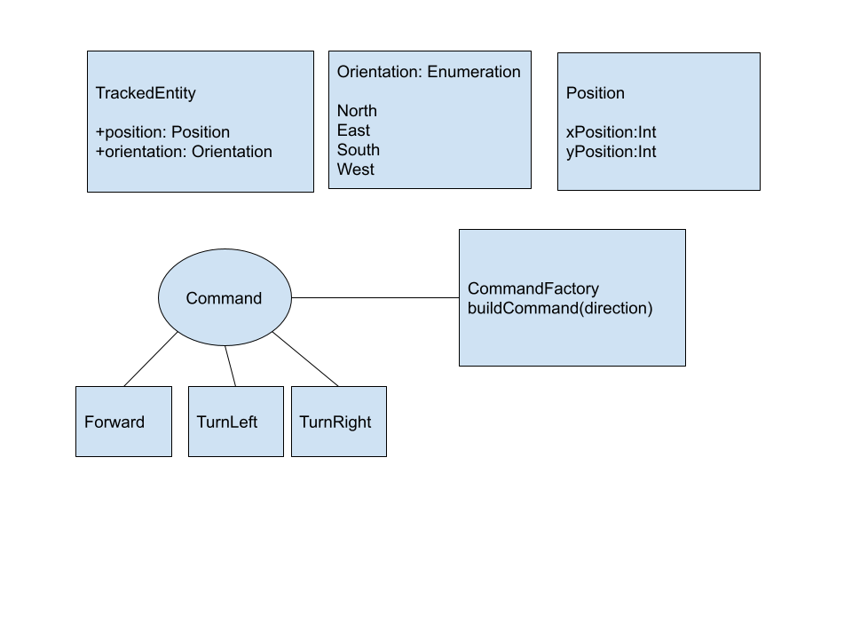

# Locator Application

Runnable as a single Command Line Application or as a deployable microservice that can pull from a Remote Repository

## Locator Command Line Interface 

Running Class LocatorCLI with 3 arguments 
Initial Position e.g. 0,0  
Initial Orientation: NORTH
Comma separated directions
e.g 0,0 NORTH forward,forward,left,forward 

java -cp "kotlin-stdlib-1.7.10.jar;slf4j-api-1.7.32.jar;locator-1.0-SNAPSHOT.jar" com.whichassignment.locator.LocatorCLIKt 0,0 NORTH forward,forward,left,forward

## Locator Spring-Boot Application 

The application can be run as a Spring-boot application that calls to an external Microservice repository or to a local stub repository

"java.exe" -jar locator-1.0-SNAPSHOT-exec.jar com.whichassignment.locator.LocatorApplicationKt

A URL call to: http://localhost:8080/api/locate/1/1/NORTH/forward,forward,left,forward
Will result in 0,3 as the response

A URL call to: http://localhost:8080/api/njdrewett@email.com/locate/0/0/NORTH 
Will result in 1,1 as the response

The Application uses the following properties:
Points to an external api for retrieving the directions.
repository:url: "http://localhost:8090/api/<identifier>/directions"
Uses the internal Stub data
useStub: true|false

## Design

The Locator Class implements the location logic

Given an initial Position, initial Orientation and list of directions:

    Validate the List of Directions,

    If valid:

        Initialise a TrackedObject with Position and Orientation

        Using the Command Design Pattern:

            For each String direction, use a CommandFactory to give an execution order to the tracked object based on the Orientation enumeration state
        
    The final Position of the Tracked Object is the final destination

        
